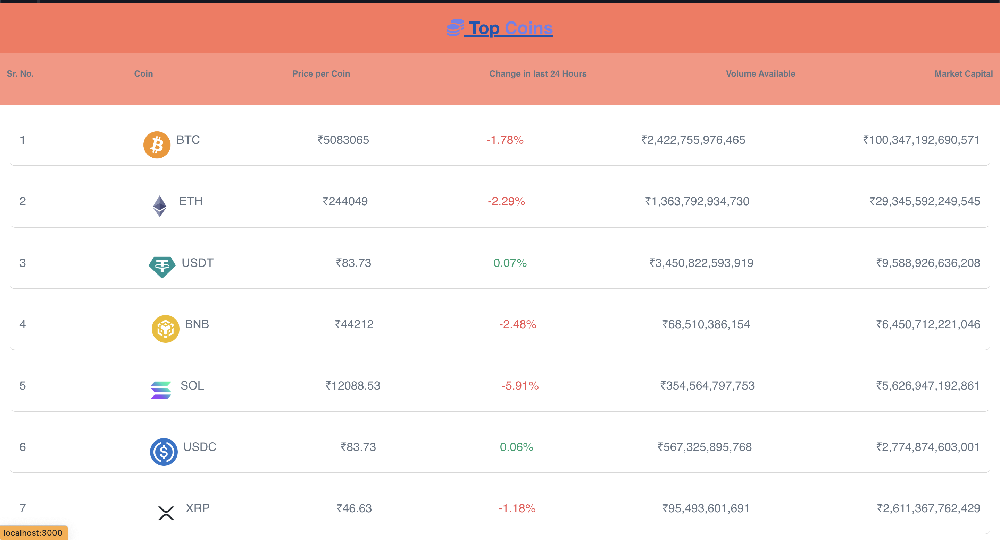

# [Brokerax - The World's Fastest Growing Crypto Web App](https://brokerax-nishant.netlify.app/)

## API's Used
- **Coin Data**:- https://www.coingecko.com/
- **Backend URL** :- https://brokerax-golang-backend.onrender.com

## TechStack
1. **Frontend** :- React-Typescript, TailwindCSS, Docker, React-three
2. **Backend** :- GoLang, Docker, Makefile, Prometheus

## Docker Images
1. **Frontend-Image** :- [nishantbansal640/brokerax-frontend](https://hub.docker.com/r/nishantbansal640/brokerax-frontend)
2. **Backend-Image** :- [nishantbansal640/brokerax-backend](https://hub.docker.com/r/nishantbansal640/brokerax-backend)

## Building Locally Using Docker
Run the following command
~~~
docker compose up
~~~
Visit: `http://localhost:3000`

## Prometheus Support
To Check Site Monitoring Visit:-
[https://brokerax-golang-backend.onrender.com/metrics](https://brokerax-golang-backend.onrender.com/metrics)

## Features

1. Sign In and Sign Up Pages with Crypto Coin Animation.

2. Implementation of Dashboard, Market Pages and real time update on current profits/Loss.

3. Smooth scrolling animation added using *aos* Library.
<video src="https://github.com/user-attachments/assets/1049c2e3-5862-4ee7-9fb6-13ae28fa04a4"></video>

4. Buying and Selling feature Implemented with real-time update on Current price of coins 

5. Made Website fully responsive

**Note**: This is a simulation website where you can experience buying and selling crypto coins. Please be aware that while the coin price data shown is real-time, the coins you buy and sell on this platform are not real and cannot be exchanged for actual cryptocurrency.
